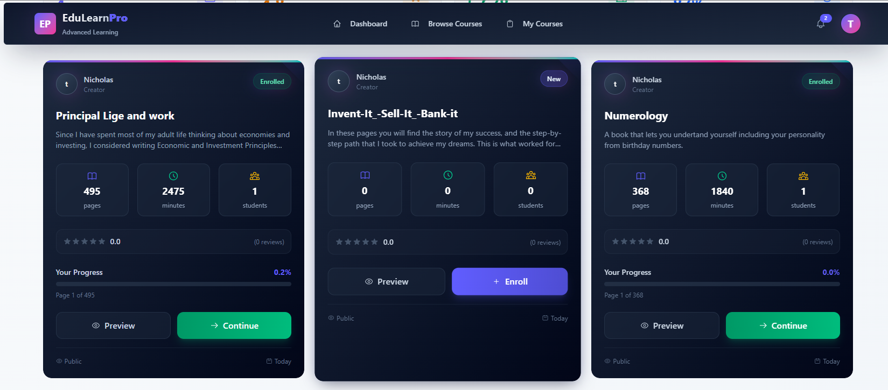
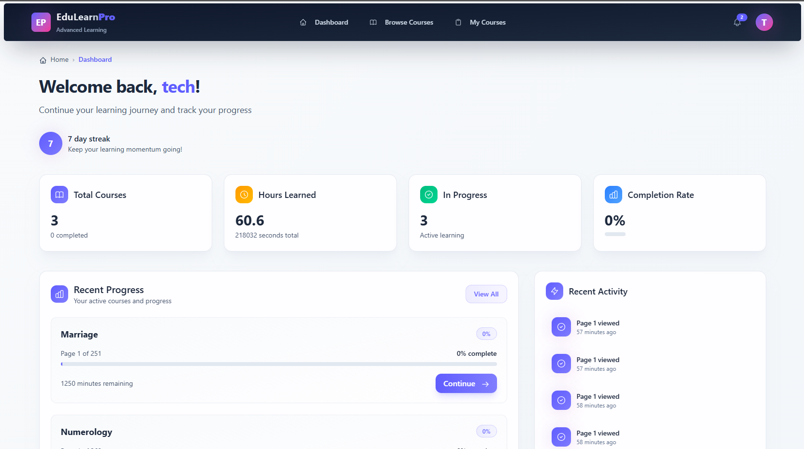
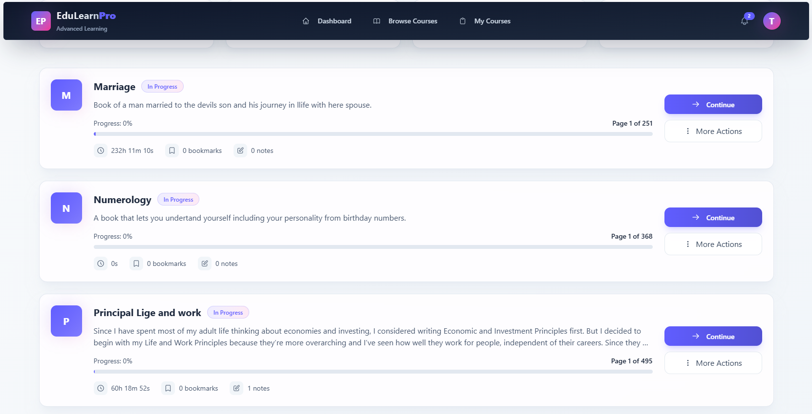
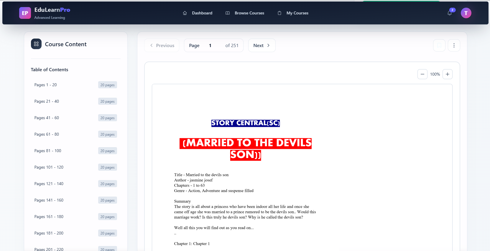

# EduLearn Pro - Online Learning Platform

## 📖 Overview

EduLearn Pro is a modern, feature-rich online learning platform built with cutting-edge web technologies. It provides an interactive environment for course creators and learners to share knowledge, track progress, and achieve educational goals through document-based courses.

## 🖥️ Previews

 

## 🎯 What It Does

### For Learners:
- **Browse & Enroll**: Discover courses across various topics and enroll with one click
- **Progress Tracking**: Automatically tracks reading progress through PDF/DOCX documents
- **Interactive Learning**: Bookmark pages, take notes, and visualize learning progress
- **Dashboard Analytics**: View comprehensive statistics about learning habits and achievements
- **Personalized Recommendations**: Get course suggestions based on interests and progress

### For Course Creators:
- **Easy Course Creation**: Upload PDF/DOCX files to create interactive courses
- **Progress Monitoring**: Track student engagement and completion rates
- **Course Management**: Edit, publish, and manage created courses
- **Analytics Dashboard**: View detailed insights into course performance

## 🛠️ How It Works

### Backend Architecture
- **Django REST Framework**: Robust API backend with JWT authentication
- **PostgreSQL Database**: Relational database for structured data storage
- **Django ORM**: Object-relational mapping for efficient database operations
- **Djoser**: Complete authentication system with JWT tokens
- **File Processing**: Automatic PDF/DOCX parsing for page counting and metadata extraction

### Frontend Architecture
- **Vue.js 3**: Reactive component-based framework for dynamic UI
- **Pinia**: Centralized state management for application data
- **Vue Router**: Client-side routing with navigation guards
- **Axios**: HTTP client for API communication with interceptors
- **Tailwind CSS**: Utility-first CSS framework for rapid UI development
- **DaisyUI**: Component library built on Tailwind CSS
- **Vuetify Icons**: Material Design icons for visual consistency

### Key Features Implementation

#### 1. **Document Processing**
- Automatically extracts metadata from uploaded documents
- Calculates page counts and estimated reading times
- Supports PDF and DOCX formats with validation

#### 2. **Progress Tracking**
- Real-time progress updates as users navigate through documents
- Automatic API calls on page navigation
- Progress percentage calculation and visualization
- Time tracking for learning analytics

#### 3. **Authentication & Security**
- JWT-based authentication with access/refresh tokens
- Token refresh mechanism for seamless user experience
- Protected routes with navigation guards
- Secure file uploads with validation

#### 4. **Responsive Design**
- Mobile-first approach with Tailwind CSS
- Adaptive layouts for all screen sizes
- Touch-friendly interactions for mobile devices

## 🚀 Tech Stack

### Frontend
- **Vue.js 3** - Progressive JavaScript Framework
- **Pinia** - State Management
- **Vue Router** - Routing
- **Tailwind CSS** - Styling Framework
- **DaisyUI** - Component Library
- **Axios** - HTTP Client
- **Vuetify Icons** - Icon Library

### Backend
- **Django** - Python Web Framework
- **Django REST Framework** - API Development
- **Djoser** - Authentication
- **PostgreSQL** - Database
- **PyPDF2** - PDF Processing
- **python-docx** - DOCX Processing

### Development Tools
- **Vite** - Build Tool & Dev Server
- **ESLint** - Code Quality
- **Prettier** - Code Formatting
- **Git** - Version Control

## 📊 Key Metrics Tracked

- **Course Progress**: Page-by-page tracking with percentage completion
- **Learning Time**: Total time spent on each course and overall
- **Streak System**: Daily learning streaks to encourage consistency
- **Completion Rates**: Course completion statistics and success rates
- **Engagement Metrics**: Bookmark usage, note-taking, and review patterns

## 🎨 UI/UX Features

- **Glassmorphism Design**: Modern transparent UI elements with blur effects
- **Real-time Updates**: Instant feedback on user actions
- **Progress Visualization**: Interactive charts and progress bars
- **Responsive Navigation**: Intuitive navigation across all devices
- **Accessibility**: WCAG compliant design with keyboard navigation
- **Loading States**: Skeleton loaders and progress indicators
- **Toast Notifications**: Non-intrusive feedback messages

## 🔄 Data Flow

1. **User Authentication** → JWT tokens stored in secure HTTP-only cookies
2. **Course Enrollment** → Creates enrollment record with progress tracking
3. **Document Navigation** → Updates progress via API on page changes
4. **Data Synchronization** → Real-time sync between frontend state and backend
5. **Analytics Collection** → Aggregated data for dashboard statistics

## 🎯 Project Goals

- Provide an intuitive platform for knowledge sharing
- Enable detailed progress tracking for learners
- Offer powerful analytics for course creators
- Ensure seamless user experience across devices
- Maintain high performance with modern web technologies